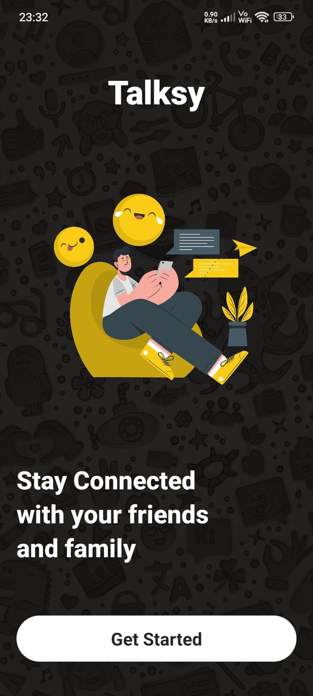
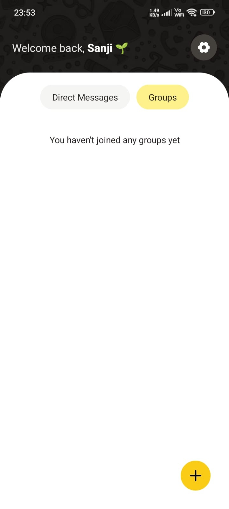

# Talksy 💬

A full-stack real-time chat application built with **React Native (Expo Router)** on the frontend and **Node.js + Socket.IO + MongoDB** on the backend.

---

## 🚀 Tech Stack

### Frontend
- React Native
- Expo Router
- TypeScript

### Backend
- Node.js
- Express
- Socket.IO
- MongoDB
- JWT Authentication

---

## 📱 App Preview

> The UI screenshots below demonstrate the core user experience of Talksy.

---

### 🟡 Getting Started & Authentication

  
  
  

---

### 🏠 Home & Conversations

  
  

---

### 💬 Direct Messaging

  

---

### 🧩 Create Group Flow

  
  
  

---

### 👥 Group Messaging

  

---

### 👤 Profile Management

  
  

---

## ✨ Features

- Real-time one-to-one chat
- Group messaging
- Media messages
- Authentication with JWT
- Profile update (name & avatar)
- Live delivery using Socket.IO
- Clean, modern mobile UI

---

## 📂 Project Structure

Talksy/
├── frontend/ # React Native Expo app
└── backend/ # Node.js + Express + Socket.IO server